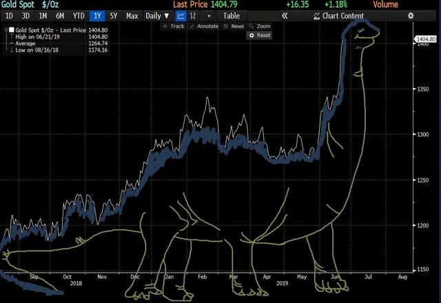

# Что готово и уже находится в репозитории:
* Все пункты первого задания
* Парсинг OHLCV по акциям, парсинг фундаментальных метрик компании
* Решения задач по мат. анализу

## Где искать решения задач тестового задания:

Весь функционал обернут в CLI в файле main.py 

1. ### Данные по криптовалютам  
    1.1. Реализован через HTTP запросы к API Binance. Функции для сбора и сохранения данных находится в `/data_fetch/get_crypto.py`. Пример данных находится в `data\ohlc_BTCUSDT.csv`

    1.2. Расчет индикаторов находится в `/indicators/metrics.py` с оптимизацией вычислений при помощи JIT.  

    1.3. Бэкенд для рендера графиков находится в двух файлах с использованием разных библиотек - matlpotlib и plotly, `\plotting\plot_data.py` и `\...\plotly_plot.py` соотв. Изначально предполагалось делать на mpl, но уже при наборе данных из 1500 дней управление графиком перестает быть 
    отзывчивым. Поэтому сделал альтернативу на более быстром plotly.  

    1.4. Пример технического анализа на основе построенных индикаторов находится в jupyter ноутбуке `notebooks\example_of_analysis_crypto.ipynb`.  


    #### Примеры запросов для демонстрации парсинга и построения графиков:
``` bash
python main.py fetch-plot-crypto --symbol BTCUSDT #mpl
python main.py fetch-plot-crypto --symbol BTCUSDT --backend plotly #plotly
```


2. ### Данные по акциям  
    1.1. За основу взят модуль yfinance, код находится в `/data_fetch/get_stocks.py`.  
    1.2. Пример данных находится в `data\ohlc_AAPL.csv` и фундаментальные показатели по нескольким компаниями в `data\fundamentals.csv`.  
    1.3. Отрисовка данных находится в тех же модулях, что и для криптовалютных данных.  

    #### Примеры запросов для демонстрации парсинга и построения графиков:
``` bash
python main.py fetch-plot-stock --symbol AAPL #mpl
python main.py fetch-plot-stock --symbol AAPL --backend plotly #plotly
```


## Требования
- Python 3.8+

### Установка
```bash
python -m pip install requests numpy pandas matplotlib yfinance plotly numba
```

## Структура
- `spb_test/data_fetch/get_crypto.py` — загрузка OHLC криптовалют c Binance
- `spb_test/data_fetch/get_stocks.py` — загрузка OHLC акций через yfinance
- `spb_test/plotting/plot_data.py` — отрисовка графиков и индикаторов из CSV (Matplotlib)
- `spb_test/plotting/plotly_plot.py` — интерактивные графики (Plotly)
- `spb_test/indicators/metrics.py` — индикаторы: `sma`, `ema`, `macd`, `rsi`, `volume_profile`
- `main.py` — CLI для управления
- `data/` — входные/выходные CSV (`crypto.csv`, `stocks.csv`, `ohlc_*.csv`)
- `notebooks/` — ноутбуки с примерами анализа

## Использование
Запускать из корня проекта.

### Крипта
- Загрузка одной пары:
```bash
python main.py fetch-crypto --symbol BTCUSDT --interval 1d --outdir data
```
- Загрузка нескольких тикеров из `data/crypto.csv`:
```bash
python main.py fetch-cryptos --list data/crypto.csv --interval 1d --outdir data
```
- Загрузка и построение графика одновременно:
```bash
python main.py fetch-plot-crypto --symbol BTCUSDT --interval 1d --sma 12,26 --ema 21,55 --outdir data
```

### Акции
- Загрузка акций одной компании:
```bash
python main.py fetch-stock --symbol AAPL --interval 1d --period 1y --outdir data
```

- Загрузка нескольких тикеров из `data/stocks.csv`:
```bash
python main.py fetch-stocks --list data/stocks.csv --interval 1d --period 1y --outdir data
```
- Загрузка и построение графика одновременно:
```bash
python main.py fetch-plot-stock --symbol AAPL --interval 1d --period 1y --sma 12,26 --ema 21,55 --outdir data
```

### Построение графиков из CSV
```bash
# Matplotlib backend
python main.py plot --path ./data/ohlc_BTCUSDT.csv --sma 12,26 --ema 21,55 --backend mpl

# Plotly backend (WebGL)
python main.py plot --path ./data/ohlc_BTCUSDT.csv --sma 12,26 --ema 21,55 --backend plotly
```

Примечания:
- `--sma` и `--ema` — список периодов через запятую, например `12,26`.
- Все данные сохраняются как `ohlc_{SYMBOL}.csv` в указанной директории `--outdir` (по умолчанию `data/`).
- `--backend` — `mpl` (Matplotlib, по умолчанию) или `plotly` (WebGL, быстрее для больших данных).
- Для акций `--start`/`--end` (YYYY-MM-DD) имеют приоритет над `--period`.

### Взаимодействие с графиками
- Колёсико мыши: зум по X (на всех панелях)
- Shift + колёсико: зум по Y (на наведённой панели)
- ЛКМ + перетаскивание: панорамирование по X (на всех панелях)
- Shift + ЛКМ + перетаскивание: панорамирование по Y (только на наведённой панели)
- Справа — чекбоксы для включения/выключения линий индикаторов

### options

Ниже перечислены команды и флаги `main.py` и примеры в скобках:

- fetch-crypto:
  - `--symbol` (BTCUSDT)
  - `--interval` (1d)
  - `--outdir` (.)

- fetch-cryptos:
  - `--list` (data/crypto.csv)
  - `--interval` (1d)
  - `--outdir` (.)

- fetch-stock:
  - `--symbol` (обязателен)
  - `--interval` (1d)
  - `--period` (1y)
  - `--start` (YYYY-MM-DD, опционально)
  - `--end` (YYYY-MM-DD, опционально)
  - `--outdir` (.)

- fetch-stocks:
  - `--list` (data/stocks.csv)
  - `--interval` (1d)
  - `--period` (1y)
  - `--start` (YYYY-MM-DD, опционально)
  - `--end` (YYYY-MM-DD, опционально)
  - `--outdir` (.)

- plot:
  - `--symbol` (альтернатива `--path`, используется для поиска `ohlc_{symbol}.csv` в `--outdir`)
  - `--path` (явный путь к CSV)
  - `--sma` (например, 12,26)
  - `--ema` (например, 12,26)
  - `--backend` (mpl | plotly; по умолчанию mpl)
  - `--outdir` (.)

- fetch-plot-crypto:
  - `--symbol` (BTCUSDT)
  - `--interval` (1d)
  - `--sma` (например, 12,26)
  - `--ema` (например, 12,26)
  - `--backend` (mpl | plotly; по умолчанию mpl)
  - `--outdir` (.)

- fetch-plot-stock:
  - `--symbol` (обязателен)
  - `--interval` (1d)
  - `--period` (1y)
  - `--start` (YYYY-MM-DD, опционально)
  - `--end` (YYYY-MM-DD, опционально)
  - `--sma` (например, 12,26)
  - `--ema` (например, 12,26)
  - `--backend` (mpl | plotly; по умолчанию mpl)
  - `--outdir` (.)